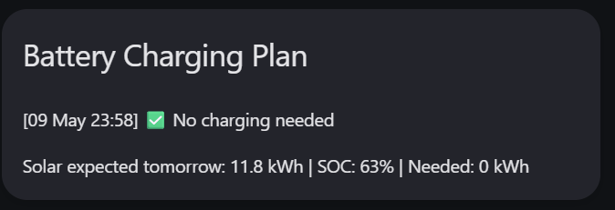

(this is very draft)

# Charge home battery with Home Assistant
The goal is to be able to charge the home battery with cheap energy during the night. But only if the expected solar production of the following day is not sufficient. Or if the battery is almost empty and some energy is needed to cover the (expensive) peak prices in the morning. It is *Not* intended for trading purposes or peak shaving, the only goal is to optimise self use at the best prices.

## Components
The following components are needed to setup this service. I mentioned the version numbers I have used during the development of this code.

-   Home Assistant 2026.5.1
-   [Alpha ESS HA integration](https://github.com/CharlesGillanders/homeassistant-alphaESS), version 0.8.4
-   [Forecast.Solar](https://forecast.solar/), with personal account. This geves more frequent update then the free version.
-   [Nordpool](https://github.com/custom-components/nordpool) for price info, based on Apex but I found this to be more stable than Entso-e which had crashed my HA install a couple of times.
-   [Pyscript](https://github.com/custom-components/pyscript) version 2.0.1, needed to run the script.
-   Terminal & SSH for troubleshooting and testing.

## Configuration
Add this to <code>configuration.yaml</code> to enable pyscript to import the required libraries

```         
pyscript:
  allow_all_imports: true
  hass_is_global: true
```

And

```         
logger:
  default: warning
  logs:
    custom_components.pyscript: info
```

To enable the logger to log all activities. This is needed for debugging and to check what happened. HA needs to be restarted after this.

Make changes to <code>smart_battery_charg.py</code> such that it matches your system and wishes. If you have renamed your Alpha ESS you need to change that here as well. I just use the default name with the serial numbers. Also update the NordPool sensor for your situation. The script uses the 15, 30, and 60 minute charge buttons which are available in the Alpha ESS integration. It basically presses these buttons during the night if the requirements (low price and low solar power next day) are met.

```         
BATTERY_CAPACITY_KWH = 9.3
CHARGE_RATE_KW       = 2.4    # Your alphaESS max charge rate (kW)
NIGHT_START_HOUR     = 23     # Start of cheap night window
NIGHT_END_HOUR       = 6      # End of cheap window (next morning)
MIN_CHARGE_KWH       = 0.5    # Skip if less than this is needed
MAX_PRICE_EUR        = 0.25   # Never charge above this price (€/kWh)
MIN_SOC_FLOOR_PCT    = 20     # Always charge to at least this SOC %

SOLAR_SENSOR    = "sensor.energy_production_tomorrow"
SOC_SENSOR      = "sensor.alpha_ess_energy_statistics_ald071026xxxxxx_ald071026xxxxxx_instantaneous_battery_soc"
NORDPOOL_SENSOR = "sensor.nordpool_kwh_nl_eur_3_095_021"

SERIAL = "ald071026xxxxxx"
BTN_BASE = f"button.alpha_ess_energy_statistics_{SERIAL}_{SERIAL}"
BTN_15   = f"{BTN_BASE}_15_minute_charge"
BTN_30   = f"{BTN_BASE}_30_minute_charge"
BTN_60   = f"{BTN_BASE}_60_minute_charge"
BTN_RST  = f"{BTN_BASE}_reset_charge_discharge"
```

## File location and start
Make sure the pythin file is on the correct location, Home Assistant (the Pyscript integration) expects it in <code>pyscript/</code>, so the folder should be at the same level as configuration.yaml. Do not create subfolders because the script will not be found.

Copy the script to the correct location and activate it via Developer Tools → YAML → Pyscript Python scripting. This needs to be done after each change to the code.

This script shall run in the background, and twice per day it makes a charging plan for the night, one at 13:30 when the new prices are known and one at 22:00 at which time the latest solar forecast data is available. Only the last one will be used for charging. The other is just for info.

If you want to have this on a dashboard you will need to make two helpers: Settings → Devices & Services → Helpers → Create Helper → Text

| Name              | Automatically created Entity ID           |
|:------------------|:------------------------------------------|
| BatteryOpt Status | <code>input_text.batteryopt_status</code> |
| BatteryOpt Detail | <code>input_text.batteryopt_status</code> |

These helpers can be used in your dashboard to show the planned info on a MarkDown card.

Example MarkDown card:

```         
type: markdown
title: Battery Charging Plan
content: |
  {{ states('input_text.batteryopt_status') }}

  {{ states('input_text.batteryopt_detail') }}
```

Which looks a bit like this 

## Testing and debugging
Functions that are preceeded by <code>@service</code> are available to run manually from Developer Tools → Actions. If the functions are not there, there is an issue with starting the script, maybe it is in the wrong location or pyscript did not start. <code>pyscript.simple_test</code>, as part of <code>debug_test.py</code>, is a function which you can use for testing if everything works. <code>pyscript.plan_night_charging_afternoon</code> can also be run safely, it plans the nightly chage based on the available data but does not actually start charging. It does update the markdown card so it is a complete test.

If all is okay the charging plans are visible in the logfiles. These can be accessed on different ways but I prefer via the Terminal/SSH as that enables quick filtering. <code>ha core logs \| grep BatteryOpt</code> gives the most recent plan but make sure to do this quickly after sending the command otherwise is will be gone again (so a bit tricky)

Example logfile:
